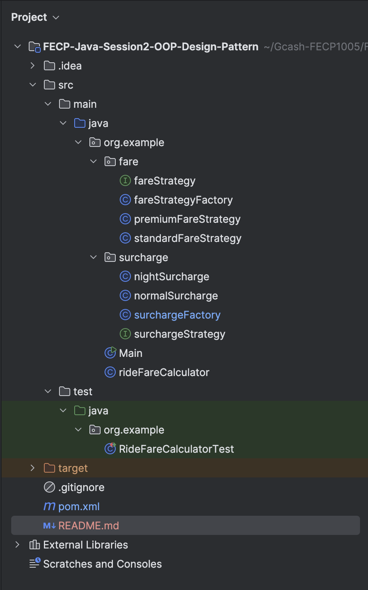
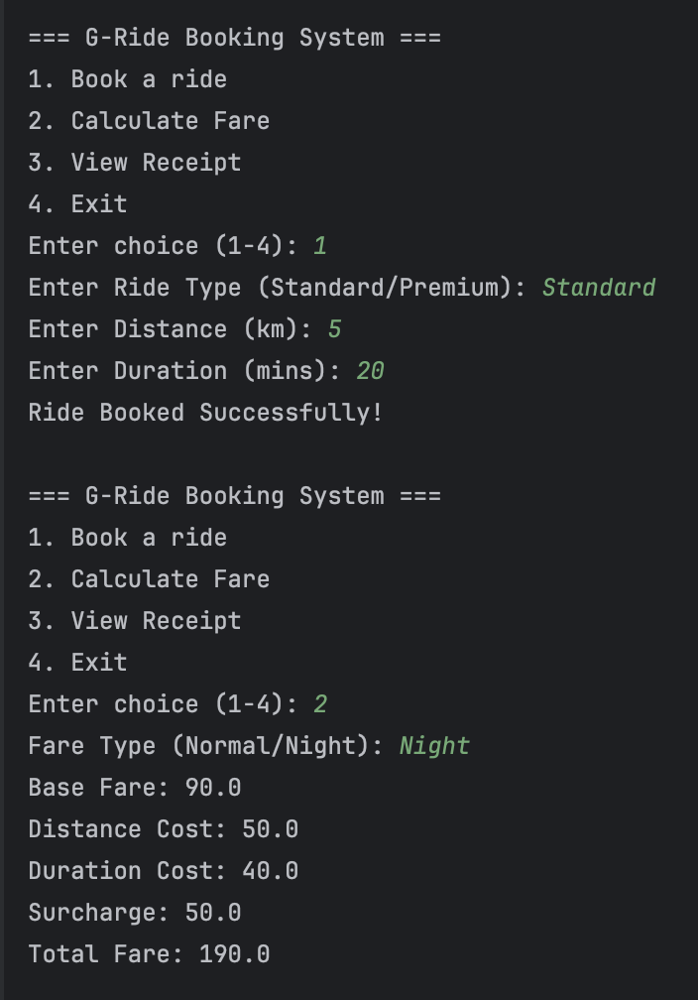
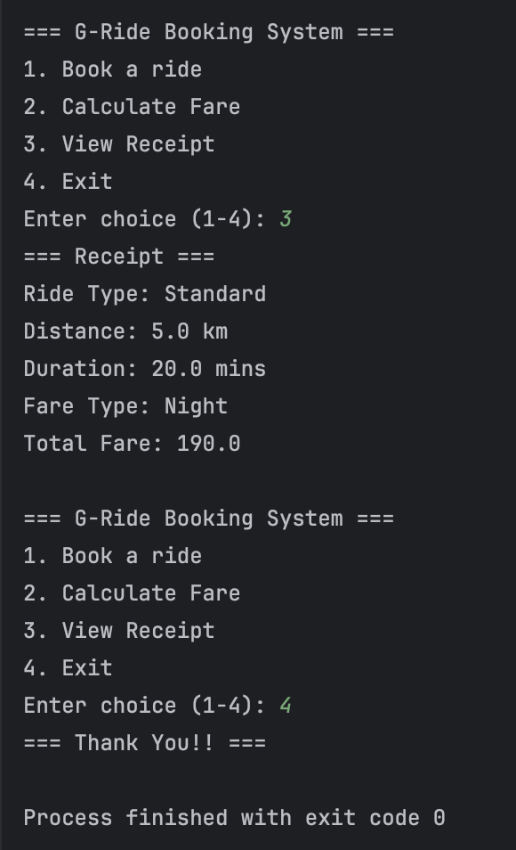

Group Members:
* Marc Vincent Alcoriza
* Francis Aldrin Belmes
* Harold Bryan Santos

Project Description:
The G-Ride Fare Calculator is a console-based Java application that simulates a simple ride booking and fare computation system, applying Object-Oriented Programming principles and key design patterns. Users can book a ride, choose between Standard or Premium vehicles, and select a fare type (e.g., Normal or Night). Based on the ride's distance and duration, the system calculates and displays a detailed fare breakdown, including base fare, distance cost, duration cost, and any surcharges.

This project demonstrates modular design, abstraction, and interaction between objects using Strategy and Factory patterns. It also includes unit testing using JUnit and uses GitHub for version control and collaboration.

Project Structure:

Output:

